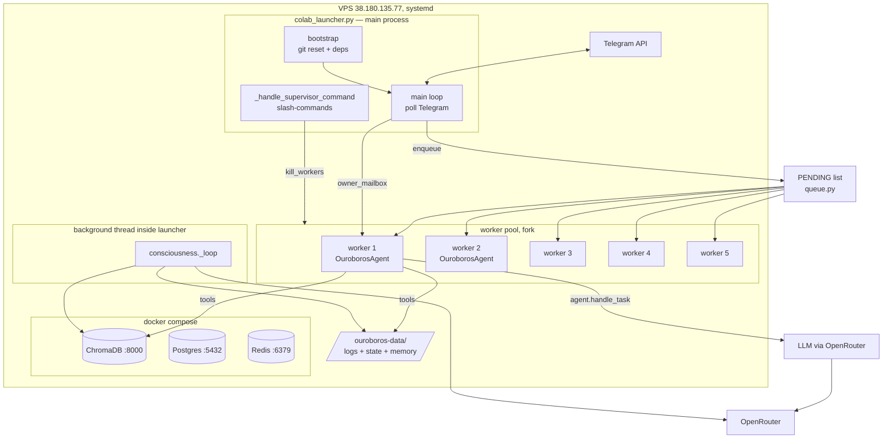
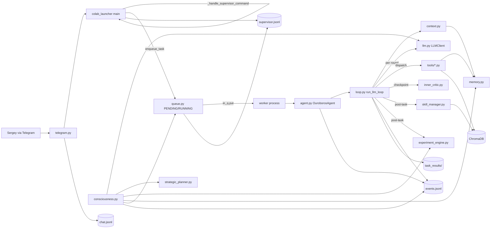
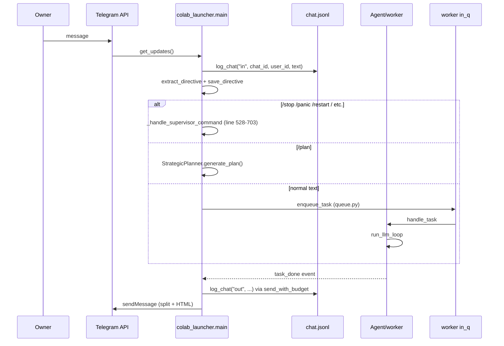

# THAI Architecture Map — 2026-04-21

Archaeological map of the **real** running system, derived from the code in
`/home/deploy/ouroboros/` at commit `fd687fb` (branch `ouroboros`, clean,
THAI currently off). Every claim carries a `file:line` reference. Norms from
BIBLE.md / CLAUDE.md / SYSTEM_COMPACT.md were consulted only to decide which
facts to record, not as sources of truth; divergences are logged in **Dark
Zones** at the end.

This is a snapshot, not a specification. Where the code contradicts the
documentation, the code wins.

---

## 0. Repository layout

```
/home/deploy/ouroboros/                 ← repo (git: Salen79/ouroboros @ ouroboros)
├── colab_launcher.py                   ← top-level process supervisor (1032 LoC)
├── ouroboros/                          ← agent runtime
│   ├── agent.py            (876)       ← OuroborosAgent class, routing, startup checks
│   ├── loop.py            (1832)       ← LLM tool loop, MAX_ROUNDS, memory protocol
│   ├── consciousness.py   (1630)       ← background cycle
│   ├── context.py          (992)       ← prompt assembly
│   ├── memory.py           (404)       ← scratchpad/identity/chat/directive IO
│   ├── llm.py              (297)       ← OpenRouter client
│   ├── skill_manager.py    (311)       ← skill lifecycle
│   ├── experiment_engine.py(528)       ← experiment runner
│   ├── pattern_detector.py (192)       ← pattern stats
│   ├── strategic_planner.py(335)       ← autonomous goal-setting
│   ├── inner_critic.py     (360)       ← mid-task advisor
│   ├── self_evolution.py   (659)       ← file zones + smoke + cooldown
│   ├── budget.py           (110)       ← daily spend cap
│   ├── owner_inject.py     (103)       ← per-task mailbox
│   ├── review.py           (200)
│   ├── apply_patch.py      (178)
│   ├── utils.py            (333)
│   └── tools/              (25 files, ~6000 LoC) ← auto-discovered plugins
├── supervisor/
│   ├── queue.py            (567)       ← PENDING/RUNNING + CommitmentTracker
│   ├── workers.py          (647)       ← multiprocess pool, boot, crash recovery
│   ├── events.py           (492)       ← event-handler dispatch
│   ├── telegram.py         (532)       ← Telegram client + chat.jsonl writer
│   ├── state.py            (678)       ← state.json persistence + budget
│   └── git_ops.py          (434)       ← git reset, clone, safe_restart
├── config/FILE_ZONES.yaml              ← red/yellow/green classification
├── prompts/                            ← SYSTEM.md, CONSCIOUSNESS.md, etc.
└── scripts/                            ← consciousness_metrics, smoke_test, etc.

/home/deploy/ouroboros-data/            ← non-tracked runtime state
├── logs/
│   ├── chat.jsonl                      ← Telegram transcript
│   ├── events.jsonl                    ← "ouroboros-side" events
│   ├── supervisor.jsonl                ← "supervisor-side" events  (note §2)
│   ├── tools.jsonl                     ← tool call arguments + results
│   └── progress.jsonl
├── state/                              ← JSON persistence (see §2)
├── memory/
│   ├── identity.md                     ← 1216 B, mtime 04-12 (see §3)
│   ├── scratchpad.md
│   ├── wisdom.md
│   ├── knowledge/                      ← topic files + _index.md
│   ├── episodic/YYYY-MM-DD.jsonl       ← episodes + skills
│   ├── chromadb/                       ← orphan empty SQLite (see Dark Zones)
│   └── .restart_marker
├── task_results/                       ← 645 JSONs, one per task
└── (docker volume ai-company_chroma_data, mounted via HTTP on :8000)
```

Tool count today: **64 registered** (auto-discovered from `ouroboros/tools/`),
of which **39 are "core"** — `ToolRegistry.schemas(core_only=True)` at
`ouroboros/tools/registry.py:137-147` returns the core subset plus two
meta-tools `list_available_tools` + `enable_tools`. CLAUDE.md says "62 total";
the true number is 64 (enumerated in §6).

---

## 1. Components — what is, where, with whom

### 1.1 Process topology



- **Main process:** `colab_launcher.py` — reads env, calls `bootstrap()`
  (`colab_launcher.py:208-287`), spawns workers (`colab_launcher.py:261-262`),
  then polls Telegram in `main()` (`colab_launcher.py:745-756`).
- **Workers:** multiprocessing pool with `fork` context on Linux
  (`supervisor/workers.py:467-499`), default 5 workers.
  Each worker runs `worker_main()` (`supervisor/workers.py:299-360`) which
  loops on an input queue and calls `agent.handle_task()` per task.
  Workers are NOT systemd services; they are child processes of the launcher.
- **Consciousness:** a background **thread** (not a separate process) created
  inside the main launcher process — `Consciousness._loop()` at
  `ouroboros/consciousness.py:191-246`. Cadence is dynamic (§5).
- **Docker stack:** three long-running containers — `ai-company-chromadb`,
  `ai-company-postgres`, `ai-company-redis`. Only ChromaDB is actually used by
  ouroboros code (the other two are idle legacy from the AI-company phase).
- **External:** Telegram Bot API + OpenRouter HTTP endpoint + GitHub (via
  `gh` CLI in tools/github.py).

### 1.2 Who talks to whom



### 1.3 Key module responsibilities (single source of truth: code)

| Module | File:line | Role (from code, not docs) |
|---|---|---|
| `OuroborosAgent` | `ouroboros/agent.py:180-199` | Per-worker instance; owns `LLMClient`, `ToolRegistry`, `Memory`. |
| `_log_worker_boot_once` | `ouroboros/agent.py:212-228` | Emits `worker_boot` exactly once per process via module-level `_worker_boot_logged` guard + `threading.Lock`. |
| `_verify_system_state` | `ouroboros/agent.py:470-510` | 4 startup checks: uncommitted changes, VERSION sync, budget, memory_core. |
| `_ensure_memory_core` | `ouroboros/agent.py:423-468` | R1: creates `identity.md` + `scratchpad.md` from placeholders if missing or 0-byte; emits `startup_memory_restore`. Added after 04-12 distress loop. |
| `_classify_message_for_routing` | `ouroboros/agent.py:41-149` | Returns `"light"` or `"full"`. See §4. |
| `handle_task` | `ouroboros/agent.py:520-727` | Dispatches to `run_llm_loop`, emits `task_received`/`task_done`. |
| `run_llm_loop` | `ouroboros/loop.py:1000-1014` | Main tool loop with MAX_ROUNDS, memory injection, critic, cost caps. |
| `_inject_memory_lookup_prompt` | `ouroboros/loop.py:623-675`, injected at `:1058` | Code-enforced memory protocol: `find_skills` + `memory_search` as first actions. |
| `_post_task_scratchpad_write` | `ouroboros/loop.py:817-896` | REPLACES scratchpad.md after every task — clears stale /panic banners. |
| `Consciousness._loop` | `ouroboros/consciousness.py:191-246` | Background cycle — see §5. |
| `StuckDetector` | `ouroboros/consciousness.py:44-78` | 3-thought similarity via word-set ratio > 0.7. |
| `ExperimentEngine` | `ouroboros/experiment_engine.py:* ` | Pattern→hypothesis→action→measure→revert. Emits to `experiments.json`, NOT events.jsonl. |
| `SkillManager.process_completed_task` | `ouroboros/skill_manager.py:216-260` | Called post-task. Writes ChromaDB + episodic JSONL. NOT events.jsonl. |
| `InnerCritic` | `ouroboros/inner_critic.py:*` | Fires at 40% and 75% of MAX_ROUNDS; **advisory only, no blocking**. |
| `StrategicPlanner` | `ouroboros/strategic_planner.py:103-138` | Generates 1-3 `PlannedTask`s. Kill switch lives in `consciousness.py:328` (`STRATEGIC_PLANNER_ENABLED` env). |
| `SelfEvolution` | `ouroboros/self_evolution.py:69-146` | Loads `config/FILE_ZONES.yaml`, classifies file/changeset. |
| `SelfModCooldown` | `ouroboros/self_evolution.py:601-660` | 3 normal tasks between self-mods. |
| `queue.py` | `supervisor/queue.py` | In-memory `PENDING` list + `RUNNING` dict; persisted to `queue_snapshot.json`. |
| `CommitmentTracker` | `supervisor/queue.py:481-567` | Tracks announced plans with deadlines; expired→consciousness nudge. |
| `workers.py` | `supervisor/workers.py:299-360` | `worker_main` loop; destructive-keyword guard at `:320-351`. |
| `telegram.py` | `supervisor/telegram.py:454-532` | `send_with_budget` with 5-min / 80% word-overlap dedup at `:31-47`. |
| `state.py` | `supervisor/state.py:126-153` | Defines state.json schema; budget + session fields. |
| `git_ops.py` | `supervisor/git_ops.py:208-315` | `checkout_and_reset()`: `git reset --hard origin/<branch>` + `__pycache__` purge. Destructive. |

---

## 2. Data flows — who writes what

### 2.1 Two event buses (not one)

THAI has **two** parallel append-only logs, and code is split sharply
between them:

| File | Writers (file count : total call sites) | Emits |
|---|---|---|
| `logs/events.jsonl` | 7 modules, 58 sites | agent.py (9), consciousness.py (30), loop.py (10), tools/control.py (2), tools/shell.py (4), tools/deep_reflection.py (1), colab_launcher.py (1), supervisor/events.py (2), supervisor/state.py (4), supervisor/workers.py (2) |
| `logs/supervisor.jsonl` | supervisor/*.py + launcher | events.py (9), git_ops.py (8), queue.py (2), telegram.py (1), colab_launcher.py (1) |

The `consciousness_metrics.py` aggregator reads **only** `events.jsonl` —
it is blind to everything emitted through `supervisor.jsonl`. This is not
in the documentation and is the real reason the Apr 20 diagnostic could
confidently say "no `panic`, `circuit_breaker`, `stuck`, `shutdown`,
`task_complete` event types exist" — several of those events DO exist, in
`supervisor.jsonl`.

Both files are written via `utils.append_jsonl()` which is a pure
line-append; no rotation, no structured schema enforcement.

### 2.2 Flow-by-sink matrix

| Sink | Path | Writers |
|---|---|---|
| `logs/chat.jsonl` | owner↔agent transcript | `supervisor/telegram.py:443-451` `log_chat()`; called from inbound at `colab_launcher.py:797,804,923` and outbound at `supervisor/telegram.py:478` (inside `send_with_budget`) |
| `logs/events.jsonl` | ouroboros-side events | see §2.1; critical sites: `agent.py:220` (worker_boot), `agent.py:459` (startup_memory_restore), `agent.py:502` (startup_verification), `loop.py:1277` (stuck_model_escalation), `loop.py:1337` (inner_critic_checkpoint), `loop.py:1761` (llm_round), `consciousness.py:733` (consciousness_thought), `consciousness.py:1058` (auto_reflection) |
| `logs/supervisor.jsonl` | supervisor-side events | `colab_launcher.py:271-282` (launcher_start), `supervisor/workers.py` (worker_crash, worker_dead_detected, crash_storm_detected), `supervisor/queue.py:257` (queue_restored_from_snapshot), `supervisor/git_ops.py` (safe_restart, rescue_commit), `supervisor/telegram.py:496` |
| `logs/tools.jsonl` | tool args + results | written implicitly by tool execution path (evidence: 04-20 investigation reconstructed THAI's `run_shell` argv from this file) |
| `logs/progress.jsonl` | progress heartbeats | `supervisor/telegram.py:472-476` (when `is_progress=True`) |
| `task_results/*.json` | one file per task | written on task completion from `loop.py`/`agent.py` (sha `loop.py:716,727` task_done emits contain the same data; exact write site in `agent.py` completion path) |
| `state/state.json` | owner_id, budget, session, sha | `supervisor/state.py:319-410` (`update_budget_from_usage`), `supervisor/git_ops.py:310-313` (current_sha after reset) |
| `state/queue_snapshot.json` | pending + running tasks | `supervisor/queue.py:177-215` (`persist_queue_snapshot`) |
| `state/daily_budget.json` | daily autonomous spend | `ouroboros/budget.py:30-37` load, `:41-62` save via `DailyBudget.spend()` |
| `state/directives.json` | stop/pause/forget directives | `ouroboros/memory.py:361-381` (`save_directive`) — keeps last 10, 24h expiry |
| `state/commitments.json` | announced tasks with deadlines | `supervisor/queue.py:508-527` (`CommitmentTracker.add/mark_done`) |
| `state/experiments.json` | experiment state | `ouroboros/experiment_engine.py:83-85` (`_save_json`) |
| `state/reflected_tasks.json` | tasks already reflected | `ouroboros/consciousness.py:978` |
| `state/consciousness_history.json` | daily metric snapshots | `scripts/consciousness_metrics.py` — cron at 23:55 local, NOT written by THAI runtime |
| `state/pending_restart_verify.json` | one-shot post-restart marker | written by launcher on `/restart`, consumed by `agent.py:233-258` (`_verify_restart`) |
| `state/self_mod_cooldown.json` | cooldown counter | `ouroboros/self_evolution.py:614` |
| `memory/scratchpad.md` | current working state | **REPLACED** (not appended) after every task — `loop.py:817-896` → `loop.py:892` `scratchpad_path.write_text()`; also snapshotted on `/panic`/`/stop` via `colab_launcher.py:391-479` `_snapshot_scratchpad_before_shutdown` |
| `memory/identity.md` | persistent self-ID | read in 5 places (listed §3.2); written ONLY via `tools/control.py:179-181` `_update_identity` and the R1 placeholder restore at `agent.py:448` |
| `memory/wisdom.md` | distilled strategy | human-edited; appended by experiment_engine on confirmed experiment (search `wisdom` in experiment_engine.py) |
| `memory/knowledge/*.md` | topic files | `tools/knowledge.py` `knowledge_write` |
| `memory/episodic/YYYY-MM-DD.jsonl` | daily episodes + skills | `tools/episodic_memory.py` (`record_memory`, `save_skill`); also `skill_manager.py:195-208` via injected callback |
| `memory/.restart_marker` | fresh-restart signal | `colab_launcher.py:473-479` (written on shutdown); read `context.py:118` |
| ChromaDB `thai_episodes` | 137 items | `tools/episodic_memory.py` via `upsert_episode()` + `consciousness.py:1049` |
| ChromaDB `thai_skills` | 25 items | two writers — `skill_manager.py:186-190` (UUID ids) AND `tools/episodic_memory.py` auto-reflection (`ep_<ts>_<slug>` ids). See PRE_RESTART_INVESTIGATION §4. |
| ChromaDB `thai_history` | 488 items | `scripts/index_history.py` (offline indexing of chat+events), reachable via `recall` tool |

### 2.3 Chat IO detail



Message dedup (`supervisor/telegram.py:31-47`): outgoing messages with
>0.8 word-overlap within 300s are skipped — except prefixes `🛑` / `⏹️`
(`:28`). Incoming messages are **never** deduped.

Chat-history truncation (`context.py:268`): when last-40-chat is injected
into context, `direction=="in"` messages are passed full-length but
`direction=="out"` messages are sliced to `raw_text[:500]`. THAI therefore
sees Sergey in full but sees its own past replies truncated.

---

## 3. Memory — 7+ storage backends with overlapping ownership

### 3.1 Storage layers

```
┌─────────────────────────────────────────────────────────────────────────┐
│  Working memory (per process/task)                                      │
│  ├─ Python in-proc: messages[] list, accumulated_usage, tool_calls      │
│  │   loop.py:1020-1040                                                  │
│  └─ Owner mailbox per task_id:                                          │
│      ouroboros-data/memory/owner_mailbox/<task_id>.jsonl                │
│      owner_inject.py:21,33,54,96                                        │
├─────────────────────────────────────────────────────────────────────────┤
│  Short-term file memory (Markdown, text)                                │
│  ├─ scratchpad.md    REPLACED per task  loop.py:892                     │
│  ├─ identity.md      tool-only write    tools/control.py:179-181        │
│  ├─ wisdom.md        rarely written     experiment_engine                │
│  ├─ knowledge/*.md   topic files        tools/knowledge.py              │
│  └─ knowledge/_index.md                  context.py:538-544 (loaded)    │
├─────────────────────────────────────────────────────────────────────────┤
│  Episodic + history (line-append)                                       │
│  ├─ logs/chat.jsonl         telegram.py:443-451                         │
│  ├─ logs/events.jsonl       agent + loop + consciousness (see §2.1)     │
│  ├─ logs/supervisor.jsonl   supervisor/*                                │
│  ├─ logs/tools.jsonl        tool dispatch                               │
│  └─ memory/episodic/YYYY-MM-DD.jsonl  daily rollups                     │
├─────────────────────────────────────────────────────────────────────────┤
│  Semantic memory (ChromaDB, HTTP on :8000, docker volume)               │
│  ├─ thai_episodes  137  insights/errors/decisions                       │
│  ├─ thai_skills     25  two writer formats (UUID vs ep_<ts>_<slug>)     │
│  └─ thai_history   488  chat+event chunks (offline indexer)             │
├─────────────────────────────────────────────────────────────────────────┤
│  State JSON (structured, read-modify-write under lock)                  │
│  ├─ state.json           budget, session, sha, owner_id                 │
│  ├─ queue_snapshot.json  PENDING/RUNNING                                │
│  ├─ daily_budget.json    daily_auto_cap spend                           │
│  ├─ directives.json      stop/pause 24h expiry                          │
│  ├─ commitments.json     announced deadlines                            │
│  ├─ experiments.json     active + completed experiments                 │
│  ├─ reflected_tasks.json task→reflection dedup                          │
│  ├─ consciousness_history.json  daily metric snapshots (cron-written)   │
│  └─ self_mod_cooldown.json                                              │
└─────────────────────────────────────────────────────────────────────────┘
```

### 3.2 Per-file ownership matrix

| File | Written by | Read by |
|---|---|---|
| `identity.md` | `tools/control.py:179-181` (_update_identity), `agent.py:448` (R1 placeholder) | `memory.py:59-65`, `consciousness.py:1100-1103`, `strategic_planner.py:158-160`, `context.py:285-286`, `context.py:395-406` (staleness), `scripts/memory_stats.py:75` |
| `scratchpad.md` | `loop.py:892` (REPLACE post-task), `colab_launcher.py:391-479` (pre-shutdown snapshot), `memory.py:57` | `memory.py:48-57`, `context.py:_build_memory_sections`, `context.py:140-170` (restart banner loads scratchpad first 800 chars) |
| `chat.jsonl` | `telegram.py:443-451` only | `memory.py:78-153` (`chat_history` tool), `memory.py:237-274` (`_load_recent_chat`), `scripts/index_history.py` |
| `events.jsonl` | see §2.1 (7 modules) | `scripts/consciousness_metrics.py`, `pattern_detector.py` (via task_results only, not events), `memory.py:78-153` (merged with chat history) |
| `supervisor.jsonl` | supervisor + launcher | `workers.py:383-410` (`_first_worker_boot_event_since`) |
| `episodic/*.jsonl` | `tools/episodic_memory.py`, `skill_manager.py:195-208` | `consciousness.py`, `recall` tool (via ChromaDB `thai_episodes` semantic layer) |
| `thai_episodes` (ChromaDB) | `consciousness.py:1049`, `tools/episodic_memory.py` | `recall`, `semantic_search`, `memory_search` |
| `thai_skills` (ChromaDB) | `skill_manager.py:186-190` + `tools/episodic_memory.py` (dual writers) | `find_skills`, `semantic_find_skills` |
| `thai_history` (ChromaDB) | `scripts/index_history.py` only (offline) | `recall` |
| `experiments.json` | `experiment_engine.py:83-85` | `experiment_engine.py` on next cycle; `consciousness.py` for status |
| `state.json` | `supervisor/state.py:319-410`, `git_ops.py:310-313` | everywhere; single lock via `state.py:_STATE_LOCK` |

### 3.3 Consistency — what's guaranteed, what isn't

| Guarantee | Enforced by | Fails when |
|---|---|---|
| `state.json` atomic RMW | `state.py` file lock | crash mid-write (manifests as partial JSON) |
| `scratchpad.md` present | `agent.py:423-468` R1 at boot | disk full |
| `identity.md` present | same | same |
| `chat.jsonl` append order | single-threaded launcher polling | parallel tools writing shouldn't happen (they don't) |
| `events.jsonl` / `supervisor.jsonl` interleave | NOT guaranteed | two separate files, no cross-linking key |
| ChromaDB ↔ `events.jsonl` consistency | **NONE** (Dark Zone #1) | always — see §7 |
| ChromaDB ↔ episodic JSONL consistency | skill_manager writes both via callback | if episodic callback throws, ChromaDB write still commits |
| Budget: `state.json.spent_usd` ↔ OpenRouter live | periodic sync in `state.py` | see `budget_drift_pct` (2.65% on 04-12) |

---

## 4. Task lifecycle — from `task_received` to `task_done`

```mermaid
sequenceDiagram
  participant Q as queue.PENDING
  participant W as worker.worker_main
  participant A as agent.handle_task
  participant C as context.build_llm_messages
  participant L as loop.run_llm_loop
  participant LLM as llm.LLMClient
  participant T as tools
  participant IC as inner_critic
  participant SM as skill_manager
  participant EE as experiment_engine
  participant EV as events.jsonl
  participant TR as task_results/

  Q->>W: in_q.get() → task dict
  W->>W: destructive-keyword guard (workers.py:320-351)
  W->>A: agent.handle_task(task)
  A->>EV: task_received (agent.py:520)
  A->>A: _classify_message_for_routing (agent.py:41-149)
  A->>C: _prepare_task_context (agent.py:586)
  C->>C: load SYSTEM.md + BIBLE.md (static cache 1h)
  C->>C: load identity+scratchpad+wisdom+knowledge_index+recent_chat (semi-stable cache)
  C->>C: load state+health+directives+restart_banner (dynamic)
  A->>L: run_llm_loop(messages, tools, llm, ...)
  L->>L: _inject_memory_lookup_prompt (loop.py:1058)
  loop per round (MAX_ROUNDS default 12 or env OUROBOROS_MAX_ROUNDS)
    L->>LLM: chat completion (routes model per classification)
    LLM->>EV: llm_usage (loop.py:1658)
    L->>EV: llm_round (loop.py:1761)
    L->>T: dispatch tool calls (loop.py:1205-1215)
    T->>EV: tool_error / tool_timeout (loop.py:213,300)
    alt round is checkpoint (40% or 75% of MAX)
      L->>IC: evaluate (inner_critic:117-211)
      IC-->>L: advisory feedback (line 1332 injected as system msg)
      L->>EV: inner_critic_checkpoint (loop.py:1337)
    end
    alt ACTION task + write_file succeeded
      L->>L: inject scope-boundary nudge (loop.py:1217-1241)
    end
    alt round≥5 AND last 3 rounds had <50 tokens AND 0 successful tool calls
      L->>L: escalate from light→full model (loop.py:1262-1281)
      L->>EV: stuck_model_escalation (loop.py:1277)
    end
    alt round > MAX_ROUNDS
      L->>L: inject [ROUND_LIMIT], one final LLM call, break (loop.py:1100-1107)
    end
  end
  L->>L: _post_task_scratchpad_write (loop.py:817-896, REPLACES scratchpad.md)
  L->>SM: process_completed_task (loop.py:1461; wrapped in try/except silent)
  SM->>ChromaDB: get_or_create_collection("thai_skills")
  SM-->>SM: should_extract? (rounds>3 AND success AND type ∈ {task,direct_chat})
  SM-->>SM: find_duplicate (ChromaDB semantic 0.8 threshold)
  SM->>LLM: extract_skill via Gemini Flash Lite (~$0.001)
  SM->>ChromaDB: add() with UUID id
  SM->>episodic JSONL: via callback (loop.py:1436-1442)
  L->>EE: record_task_for_experiments (loop.py:1493; wrapped try/except silent)
  EE->>experiments.json: _task_matches_experiment → maybe conclude
  L->>TR: write task result JSON
  L->>EV: task_done (agent.py:716,727)
  A->>W: return events
  W->>Q: task removed from RUNNING
```

### 4.1 Fixed invariants during a task

- **MAX_ROUNDS** default `12` (`loop.py:1050`), clamped `min(1, env_val)` —
  CLAUDE.md says 25, code says 12.
- **Per-task cost cap** default `$3.00` (`loop.py:465` `OUROBOROS_MAX_TASK_COST`)
  — CLAUDE.md says $5.00.
- **Budget percentage hard stop:** if task spends ≥50% of remaining budget,
  hard-stop (`loop.py:485`).
- **Circuit breaker "3 empty responses":** implemented as `max_retries=3`
  (`loop.py:1034`) before swapping to fallback model
  `google/gemini-2.5-pro-preview,openai/o3,anthropic/claude-sonnet-4.6`
  (`loop.py:1158`).
- **Destructive-keyword worker guard** (`supervisor/workers.py:320-351`):
  worker **refuses to execute** a task whose text contains
  delete/refactor/cleanup keywords — this is enforced in the worker before
  the agent ever sees the task.
- **Memory protocol (hardcoded first steps):** `_inject_memory_lookup_prompt`
  (`loop.py:623-675`) injects mandatory `find_skills` + `memory_search`
  calls. Includes file-editing override (`:660-669`) that swaps these for
  read→edit→test when the task names a file path, and a hardcoded language
  rule at `:671-673` ("ALL your output text … MUST be in Russian").
- **Scope boundary nudge** (`loop.py:1217-1241`): one-shot, per task, on
  first successful `drive_write`/`repo_write_commit`/`repo_commit_push` if
  task text contains action keywords.

### 4.2 Model routing — the full truth

`_classify_message_for_routing` (`agent.py:41-149`) returns `"light"` or
`"full"`. Decision order:

1. `task_type in {"evolution","review","consciousness"}` → `"full"` (`:58`)
2. `task_type=="task"` + any heavy keyword (implement/fix/deploy/.py/…) → `"full"` (`:71-75`)
3. `task_type=="task"` + only light keywords (ops:/check/status/…) → `"light"` (`:65-69`)
4. Any deep-dialogue keyword (миссия/consciousness/identity/strategy/CEO/…) → `"full"` (`:91-115`)
5. Message `< 60 chars` with no `?` and no action keyword → `"light"` (`:85, 122`)
6. Otherwise → `"full"` (`:87`)

Mid-task escalation: after round 5, if the last 3 rounds ALL have
`completion_tokens < 50` AND `0` successful tool calls, the next call is
forced to `llm.default_model()` once per task (`loop.py:1262-1281`). Emits
`stuck_model_escalation`.

---

## 5. Consciousness cycle — the background thread

Entry: `Consciousness._loop()` at `ouroboros/consciousness.py:191-246`.

### 5.1 What runs per cycle (in order)

```
while running:
  1.  Sleep (self._next_wakeup_sec)          default 300s; dynamic (§5.3)
  2.  Skip if in active dialogue             owner <30m ago → 60s wait instead
  3.  ops_check every N ticks                consciousness.py:206, emits ops_check
      on services down → ops_incident, attempts systemctl restart
  4.  _maybe_strategic_plan                  consciousness.py:325-451
      KILL SWITCH FIRST:
        STRATEGIC_PLANNER_ENABLED env != "true" → emit strategic_planner_disabled
        reason="env_guard", return.  (line 328).
      Then budget guard: if spent_usd ≥ 95% of TOTAL_BUDGET, emit
        strategic_plan_blocked_budget (line 350), return.
      Then call StrategicPlanner.generate_plan(), enqueue tasks.
  5.  cost cap check                         OUROBOROS_CONSCIOUSNESS_COST_CAP=$0.10
      if cycle cost exceeded → emit consciousness_cost_cap_exceeded (line 668), skip think.
  6.  think cycle                            consciousness.py:~500-740
      Load context (identity, scratchpad, recent events, active commitments).
      Call light model with tool access (whitelist: update_scratchpad, record_memory,
      save_skill, find_skills, memory_search, update_identity, schedule_task,
      send_owner_message, knowledge_read/write, chat_history, deep_reflection,
      recall, semantic_search — plus a few more; see consciousness.py:1273-1300).
      Emits consciousness_thought (line 733).
  7.  StuckDetector.check                    if 3 last thoughts are >0.7 word-similar,
                                             emit consciousness_stuck (line 762),
                                             set next sleep to 7200s, send owner alert.
  8.  Commitment nudge                       CommitmentTracker.get_expired()
                                             → proactive_message for each expired task (line 779-788)
  9.  Experiment cycle                       consciousness.py:802-852
      ExperimentEngine.run_full_cycle()      → maybe start experiment; if so, emit
      experiment_started (line 818).
      Report concluded experiments → experiment_concluded (line 837).
  10. Auto-reflect                           consciousness.py:865-982
      If a task completed since last cycle AND not already in reflected_tasks.json,
      generate reflection (type: insight/error_pattern/skill), write to
      episodic/YYYY-MM-DD.jsonl, upsert to ChromaDB thai_episodes, emit
      auto_reflection event.
  11. Daily chat backup                      consciousness.py:1255
      Once per day: snapshot chat.jsonl to memory/milestones/chat_<date>.jsonl.
```

### 5.2 Tool whitelist for consciousness

Defined at `consciousness.py:1273-1300`. **Not** the full tool set — the
consciousness thread cannot `run_shell`, cannot commit git, cannot do
web search from within a thought cycle. `update_identity` IS in the
whitelist (`:1281`) — the consciousness thread can rewrite identity.md.

### 5.3 Sleep cadence

| Condition | Next wakeup | File:line |
|---|---|---|
| Default | 300s | init |
| Active dialogue (owner wrote <30m ago) | 60s | `:223` |
| Overnight mode (19:00-07:00 UTC) | 600s | `:214` |
| Budget exceeded | 3600s | `:228` |
| StuckDetector triggered | 7200s | `:760` |

Every cycle eagerly checks and can overwrite `self._next_wakeup_sec`.

### 5.4 Proactive message gates

`send_owner_message` from consciousness is gated through 7 distinct
guards (all emit `consciousness_proactive_skipped` with a reason):

- Language not Russian (`:1445-1450`, emits `consciousness_language_blocked`)
- Active-dialogue window (`:1377-1426`)
- Quiet mode (goodbye seen, `:1333-1375`)
- `owner_hold` in state.json (`:1498-1513`)
- 120s cooldown post-task (`:1484-1495`)
- Same reason within 30m (`:1453-1468`)
- Various other specifics (`:1505-1510, 1518-1523, 1530-1535`)

---

## 6. Tool landscape — 64 registered, 39 core

Auto-discovery: `ToolRegistry._load_modules()` at
`ouroboros/tools/registry.py:110-126` iterates `pkgutil.iter_modules()` on
`ouroboros.tools`, imports each module, collects `ToolEntry` via
`get_tools()`. Core subset defined by `CORE_TOOL_NAMES` at `registry.py:79-95`.

### 6.1 Full registered list (alphabetical, 64 items)

```
analyze_screenshot       browse_page             browser_action
cancel_task              chat_history            check_evolution_status
chromadb_stats           claude_code_edit        close_github_issue
codebase_digest          codebase_health         comment_on_issue
compact_context          create_github_issue     deep_reflection
drive_list               drive_read              drive_write
enable_tools             find_skills             forward_to_worker
generate_evolution_stats get_github_issue        get_task_result
git_diff                 git_status              knowledge_list
knowledge_read           knowledge_write         list_available_tools
list_github_issues       memory_search           multi_model_review
promote_to_stable        propose_change          read_service_logs
recall                   recent_session          record_memory
repo_commit_push         repo_list               repo_read
repo_write_commit        request_restart         request_review
restart_service          run_ops_check           run_shell
save_skill               schedule_task           semantic_find_skills
semantic_search          send_owner_message      send_photo
summarize_dialogue       switch_model            toggle_consciousness
toggle_evolution         update_identity         update_scratchpad
vlm_query                wait_for_task           web_search
apply_change             analyze_screenshot      (= total 64)
```

### 6.2 Write-capable tools (modify persistent state)

| Tool | Module:line | Sink | Notes |
|---|---|---|---|
| `drive_write` | `tools/core.py:54` | file in `ouroboros-data/` | path sanitized via `safe_relpath` |
| `update_scratchpad` | `tools/control.py:134-145` | `memory/scratchpad.md` | tool-triggered; loop.py also replaces post-task |
| `update_identity` | `tools/control.py:179-181` | `memory/identity.md` | **ONE of two writers** (other is R1 placeholder) |
| `record_memory` | `tools/episodic_memory.py` | `memory/episodic/*.jsonl` + ChromaDB | |
| `save_skill` | `tools/episodic_memory.py` | same | dual sink |
| `knowledge_write` | `tools/knowledge.py` | `memory/knowledge/*.md` | topic regex `[a-z0-9_-]+`, reserved-name list |
| `knowledge_delete` | `tools/knowledge.py` | same | deletes .md in knowledge/ only |
| `repo_write_commit` | `tools/git.py` | git repo + push | pre-push pytest run |
| `repo_commit_push` | `tools/git.py` | same | git lock 120s |
| `propose_change` / `apply_change` | `tools/evolution.py:26` | git + ChromaDB skill | zone-classified; smoke tests before merge |
| `schedule_task` / `cancel_task` | `tools/control.py` | `queue.PENDING` | subtask depth limit MAX_SUBTASK_DEPTH=3 |
| `request_restart` | `tools/control.py:21` | triggers `os.execv` in launcher | blocked without successful push (`:22-29`) |
| `promote_to_stable` | `tools/control.py` | git push to stable branch | |
| `toggle_evolution` / `toggle_consciousness` | `tools/control.py` | `state.json` | |
| `create_github_issue` / `close_github_issue` / `comment_on_issue` | `tools/github.py` | GitHub API | `gh` CLI wrapper, 30s timeout |
| `restart_service` | `tools/ops.py` | systemd | service-name whitelist, 5s timeout |
| `send_owner_message` | `tools/control.py` → telegram | Telegram API + chat.jsonl | dedup applies |
| `send_photo` | `tools/core.py` / `browser.py` | Telegram | |

### 6.3 Potentially destructive (beyond "writes a file")

| Tool | Why | Guard |
|---|---|---|
| `run_shell` | arbitrary subprocess | 120s default timeout (`tools/shell.py:21`); cwd restricted to repo (`:141-145`); no shell-command allowlist |
| `claude_code_edit` | invokes external Claude Code CLI → can do anything | same envelope as `run_shell` |
| `knowledge_delete` | `.unlink()` inside `knowledge/` only | path containment via `.relative_to()` |
| `request_restart` | `os.execv()` replaces launcher process | refuses if local commits are not pushed |
| `promote_to_stable` | `git push` `BRANCH_DEV` → `BRANCH_STABLE` | none beyond that the action itself is gated by a separate approval path |
| `restart_service` | `systemctl restart` | whitelist of service names (`tools/ops.py:34-39`) |
| `apply_change` | can merge code across zones | FILE_ZONES yaml + smoke tests; RED zone auto-merge blocked |
| `_update_identity` | overwrites identity.md wholesale | none — last write wins |

### 6.4 Read-only / analysis tools

`repo_read`, `repo_list`, `drive_read`, `drive_list`, `chat_history`,
`memory_search`, `find_skills`, `semantic_search`, `semantic_find_skills`,
`recall`, `recent_session`, `knowledge_read`, `knowledge_list`,
`chromadb_stats`, `deep_reflection`, `codebase_health`, `codebase_digest`,
`multi_model_review`, `browse_page`, `analyze_screenshot`, `vlm_query`,
`git_status`, `git_diff`, `read_service_logs`, `list_github_issues`,
`get_github_issue`, `list_available_tools`, `check_evolution_status`,
`web_search`, `wait_for_task`, `get_task_result`, `switch_model`,
`generate_evolution_stats`, `forward_to_worker`, `summarize_dialogue`,
`compact_context`, `enable_tools`, `request_review`.

### 6.5 Execution guards (registry-level)

- `ToolRegistry.execute` (`tools/registry.py:171-180`) catches `TypeError`
  (arg mismatch) and generic `Exception` → returns error string, does NOT
  raise. Every tool failure becomes observable data, never a crash.
- Per-tool timeouts are set at `ToolEntry.timeout_sec`; loop.py wraps
  dispatch in `_execute_with_timeout` (`loop.py:394`) and emits
  `tool_timeout` on exceed.
- `enable_tools` meta-tool can dynamically expand the accessible toolset
  for a task beyond `CORE_TOOL_NAMES`.

---

## 7. Known Dark Zones

Only observations. No norms, no recommendations.

### D1. Two parallel event logs, not one
`logs/events.jsonl` and `logs/supervisor.jsonl` are separate files with
disjoint writer sets (§2.1). `scripts/consciousness_metrics.py` reads
only `events.jsonl`. No file cross-links them by task_id or timestamp.
Any audit that assumes a single log will silently miss 40%+ of events.

### D2. SkillManager and ExperimentEngine emit to ChromaDB and `*.json`, never to events.jsonl
`skill_manager.py` has zero references to `events.jsonl` /
`append_jsonl`; it writes to ChromaDB `thai_skills` (`:186-190`) and to
`memory/episodic/YYYY-MM-DD.jsonl` via an injected callback (`:195-208`).
`experiment_engine.py` writes only to `state/experiments.json`
(`:83-85`). The `consciousness_metrics.py` aggregator populates
`meta_cognition.skills_created_today` by counting `skill_extracted` events
in `events.jsonl` — a type that is never emitted — so every day the score
sits at 0.0 even if skills are being written.

### D3. Outgoing chat messages truncated to 500 chars when reinjected
`context.py:268` — `raw_text if is_incoming else raw_text[:500]`. Incoming
messages are preserved full-length; outgoing messages (THAI's own past
replies) are sliced. THAI therefore cannot reliably re-read long responses
it sent earlier. Comment on lines `:266-267` states the intent.

### D4. `thai_skills` has two independent writers producing different metadata schemas
- UUIDv4 ids from `skill_manager.py:186-190` — metadata has `name`,
  `tools`, `rounds_at_creation`, `avg_rounds`, `times_used`, `times_helped`,
  `times_matched`, `score`, `created`.
- `ep_<ts>_<slug>` ids from `tools/episodic_memory.py` auto-reflection —
  metadata has `ts`, `title`, `date`, `tags`, `importance`, `type="skill"`.

These are queried by the same `find_skills` tool. Dedup
(`skill_manager.py:63-93`) is semantic-similarity only — it does not
de-conflict the two id formats. A "skill" returned by `find_skills` may
have fields the consumer expects or may not.

### D5. No skills written to ChromaDB after 04-07 despite active runtime through 04-12
Creation-day histogram from the 04-20 investigation: 4 on 04-01, 6 on
04-03, 6 on 04-04, 1 on 04-05, 4 on 04-07, 4 unknown — zero on 04-08..04-12.
Code paths that would have caused silence: all 5 failing tasks on 04-12
had `success=False` (MAX_ROUNDS overflow → `success=not _hit_max_rounds`
→ False at `loop.py`), so `should_extract` gate at `skill_manager.py:47-57`
returned None. Also the `current_rounds ≥ avg_rounds` branch at
`:242-245` on dedup match returns None without writing. Both return None
and both are indistinguishable from "nothing happened" because the wrapping
`try/except` at `loop.py:1481-1482` silences all other failure modes into
`log.debug(..., exc_info=True)`.

### D6. Auto-resume on every restart is structural, not opt-in
`colab_launcher.py:287` calls `auto_resume_after_restart()` unconditionally
on every bootstrap. The function (`workers.py:196-292`) checks for
`pending_restart_verify.json` or a recent `launcher_start`/`restart` event
in `supervisor.jsonl` (`:210-231`), reads scratchpad for an ACTIVE section
(`:234-250`), then spawns a thread that calls `handle_chat_direct()` with
a "resume" message (`:268-279`). The 04-20 chromadb mismatch incident
started from one of these auto-resume tasks (`0587db33`, 5 rounds, $0.03),
which means every single restart spends at least one LLM round on
auto-resume even when the human didn't ask for it.

### D7. `_log_worker_boot_once` uses a module-level global guard
`agent.py:155-156, 212-228`: `_worker_boot_logged = False` at module
level, protected by `threading.Lock`. Because the launcher uses `fork`
multiprocessing, each worker process inherits `_worker_boot_logged=False`
at fork time and logs its own boot — correct for production. But in tests
that import `agent.py` multiple times in the same process, the flag
persists between tests and suppresses expected `worker_boot` emissions.
This is the R1 investigation's "structural quirk".

### D8. Strategic planner kill switch defaults to OFF and stays OFF
`consciousness.py:328` — `if os.environ.get("STRATEGIC_PLANNER_ENABLED",
"false").lower() != "true":` → emit `strategic_planner_disabled
reason="env_guard"`, return. `TRIAGE_APR10.md:24` confirms this was
introduced as a kill switch. The env var is not in `.env`; no tooling
prompts to flip it. Between 10:54 and 13:40 on 04-12 the disabled event
fired 34 times (every ~30 min). Planning has been effectively dead since
the triage merge on 04-11 19:22.

### D9. Shared OpenRouter key between THAI and Prism
`OPENROUTER_API_KEY` in `~/ouroboros/.env` matches byte-for-byte the key
in `/opt/prism/backend/.env` (per Apr 20 diagnostic §K.3). There is no
application-level separation of budget on OpenRouter's side. The +$75.23
lifetime OpenRouter delta between 04-12 and 04-20 — while THAI was off
— proves Prism is burning credit against THAI's budget cap.
`budget.py` daily cap operates on `ouroboros-data/state/daily_budget.json`
only, so THAI's local cap cannot protect against Prism drain.

### D10. Two orphan ChromaDB scaffolds on disk
- `ouroboros-data/memory/chromadb/chroma.sqlite3` (188 KB, mtime 04-05,
  0 collections) — from an old experiment, 16 days untouched.
- `ouroboros-data/chromadb/chroma.sqlite3` (188 KB, mtime 04-20 19:46:14,
  0 collections) — created by THAI's own `run_shell` on 04-20 when it
  called `chromadb.PersistentClient(path='/home/deploy/ouroboros-data/chromadb')`
  with a non-existent path, which silently created the empty store. Report
  at CHROMADB_MISMATCH_2026-04-21.md §3-4.

Neither is referenced by runtime code. `semantic_memory.py:22-23` hardcodes
`CHROMADB_HOST="localhost"`, `CHROMADB_PORT=8000` — there is no env-var
indirection, so the only legitimate path is the docker HTTP endpoint.

### D11. MAX_ROUNDS discrepancy: doc says 25, code default is 12
`loop.py:1050` — `MAX_ROUNDS = int(os.environ.get("OUROBOROS_MAX_ROUNDS", "12"))`.
`.env` does NOT set `OUROBOROS_MAX_ROUNDS`. CLAUDE.md:108 says 25.
Shutdown chat on 04-12 shows "Task exceeded MAX_ROUNDS (12)" — matching
the code, contradicting the doc.

### D12. Per-task cost cap discrepancy: doc says $5, code default is $3
`loop.py:465` — `OUROBOROS_MAX_TASK_COST` env default `3.0`. CLAUDE.md:203
says $5.00. `.env` does not set this.

### D13. Directives system is subtle: extraction regex is keyword-based, 24h window, 10-entry cap
`memory.py:340-358` `extract_directive` triggers on literal Russian
("останови", "забудь", "пауза") or English ("stop", "forget", "pause")
substring — no context awareness. A task titled "stop the old cron job"
would register a global STOP directive. `save_directive` keeps only the
last 10 (`:376-380`) and expires after 24h (`:372`). Injection into
context happens at `context.py:559-574` as a markdown block headlined
"⚠️ Active Shareholder Directives (OVERRIDE task plans)".

### D14. `identity.md` is read in 5 places, each silently skips if absent
All five call sites guard with `if identity_path.exists()` — PRE_RESTART
§1 lists them. Before the R1 fix (commit `08047f7`, 04-14), a missing
`identity.md` produced no warning anywhere in `events.jsonl` or in the
startup_verification event. The distress spiral on 04-12 happened inside
LLM content, not code: the model re-asserted absence even after
`_update_identity` succeeded because the model's conversation context
still contained the original framing. R1 (`agent.py:423-468`) now
guarantees the file exists non-empty before any task runs, but does NOT
re-verify in the LLM's context — the model could still believe a stale
premise about identity.

### D15. R1 silently auto-restores; no loud telemetry on first use
`agent.py:441-454`: if a file is missing, a placeholder is silently
written and `startup_memory_restore` is emitted with the restored file
list. Emission only happens if `restored` is non-empty (`:457`), so the
typical case (both files present) is indistinguishable from the "file was
just restored seconds ago" case by anyone reading only
startup_verification. A search for `startup_memory_restore` in
`events.jsonl` gives the signal, but no dashboard surfaces it.

### D16. `run_shell` is the escape-hatch bypass for every other guard
`tools/shell.py:21` executes arbitrary Python/bash with cwd restricted
to the repo but no command allowlist. The first-class ChromaDB guards in
`semantic_memory.py` (hardcoded host, graceful fallback, heartbeat) protect
the legitimate `recall` / `semantic_search` paths but are irrelevant the
moment the LLM writes `import chromadb; chromadb.PersistentClient(...)`
inside a `run_shell` call. D10 is one instance of this.

### D17. Worker destructive-keyword guard can refuse tasks before the agent sees them
`supervisor/workers.py:320-351`: the worker scans task text for
delete/refactor/cleanup/DROP/etc. keywords and refuses execution before
calling `agent.handle_task`. The refusal is emitted to `events.jsonl`
(via the agent in downstream paths that are wired differently) but a
task that looks dangerous in its description — even if its actual action
would be safe — never gets to the LLM. This is invisible to the LLM and
to the owner unless they inspect `supervisor.jsonl`.

### D18. `pattern_detector` scans `task_results/` only — not events.jsonl
Despite what the architecture description implies, `pattern_detector.py`
reads `task_results/` JSON files (`:115-138`) and does NOT parse
`events.jsonl`. So "recurring_error" patterns are grounded only in what
the task-result JSON captured, not in every `tool_error`/`tool_timeout`
event. Patterns missed here silently become patterns the experiment
engine cannot see.

### D19. CommitmentTracker state lives in `commitments.json`, written by both supervisor.queue and consciousness
`supervisor/queue.py:502-567` writes it; `consciousness.py:773-788` reads
`get_expired()` from it. Two processes (launcher main thread and
consciousness thread) in principle could write concurrently — in practice
both live in the same Python process so GIL protects them, but there is
no explicit lock at the JSON level.

### D20. `current_sha` in state.json drifts — written only on `git reset`, not on self-commit
`git_ops.py:310-313` updates `state.json.current_sha` after
`checkout_and_reset`. THAI's own `repo_commit_push` / self-commits do
NOT update this field. On 04-12, state.json said `e5ddd048…` but live
HEAD was `fd687fb` — an auto-commit from 04-11 19:37 that never made it
to state.json. Anything downstream reading `state.json.current_sha` as
ground truth (e.g. drift diagnostics) silently uses yesterday's SHA.

### D21. `daily_budget.json` is THAI's only local cap; the $500 `TOTAL_BUDGET` lives in OpenRouter
`budget.py:30-37` caps `OUROBOROS_DAILY_AUTO_CAP=$50` local. The
`TOTAL_BUDGET=500` in `.env` is checked in `context.py:369` by reading
live OpenRouter credits. There is no `budget.json` file despite multiple
references in scripts and prose; budget accounting is split across
`state.json` (lifetime) and `daily_budget.json` (daily).

### D22. `_post_task_scratchpad_write` reads the scratchpad's previous entry from `state/state.json`
`loop.py:817-896` builds the new scratchpad using `prev_task_id` and
`prev_short` from state, not from the scratchpad itself. If state.json is
stale (D20-style drift), the scratchpad will reference an incorrect
previous task. No verification between scratchpad content and state.json
exists.

### D23. Post-restart banner detection is time-based with a 300s window
`context.py:118-128`: the POST-RESTART DETECTED banner is shown only if
`memory/.restart_marker` is less than 300s old. A restart that takes
longer than 5 minutes to boot the first task (rare, but e.g. after a long
`git clone` on a clean `ouroboros-data`) would skip the banner entirely
and leave the LLM with no cue that a restart happened.

### D24. `inner_critic` does not block — it injects advice as a system message
`inner_critic.py:1,59`: the critic produces JSON with `on_track,
confidence, suggestion` and returns formatted text. That text is
inserted into the conversation at `loop.py:1332` as a `role="system"`
message. The LLM may ignore it. `on_track=False` has no programmatic
effect beyond the advisory — no task is aborted, no rounds are reclaimed.

### D25. Consciousness thread has `update_identity` in its whitelist
`consciousness.py:1281` — the light-model consciousness cycle can
rewrite `identity.md` entirely. No approval gate, no diff review, no
owner notification. This is the one writer besides the R1 placeholder
and the regular `_update_identity` tool call during a task.

### D26. `run_shell` guards do not read script files referenced by exec
`tools/shell_guards.py:PATTERNS` (commit `a99a345`, D16 closure) catches
inline forms — `python -c "...PersistentClient..."`,
`bash -c "python -c ..."`, direct `rm -rf` against critical paths — by
matching against the parsed argv. It does NOT read the contents of
files referenced by `python /tmp/evil.py` or `bash /tmp/evil.sh`. A
two-step bypass (`drive_write` / `repo_write_commit` to stage code,
then `run_shell` to execute it) sidesteps every pattern. The
code-executor gate in `_looks_like_code_executor` (`shell_guards.py:67`)
sees only the executor head and its flags, not the file payload.
Severity: medium — requires two tool calls, less likely than the inline
case D16 originally exposed, but still reachable by an LLM under
pressure to "just make the check work." Possible fix: when argv looks
like `python <file>` / `bash <file>`, read the file and run the same
pattern set against its contents (extra disk read per exec).

### D27. `claude_code_edit` bypasses `run_shell` guards entirely
`tools/shell.py:286 _claude_code_edit` accepts a free-form `prompt`
string and dispatches it to the Claude CLI via `_run_claude_cli`
(`shell.py:166`) — never through `_run_shell`, so
`shell_guards.check_command` never sees it. A prompt like "write a
script that calls `chromadb.PersistentClient(path='/tmp/x')` and run
it" would be honored by the delegated CLI without tripping any
D16-era pattern. Today's only constraints are the
`STRICT: Only modify files inside {work_dir}` preamble
(`shell.py:319`) and the `--tools Read,Edit,Grep,Glob` allowlist
(`shell.py:173`) — neither blocks Python execution requested via the
edit prompt's content. Severity: medium, dependent on how often THAI
delegates ChromaDB / critical-state work to Claude CLI. Possible fix:
either run the same pattern matchers over the prompt text before
dispatch (treat suspicious prompts as `SHELL_BLOCKED`-equivalent) or
restrict `claude_code_edit`'s working directory away from
`ouroboros-data/` and the in-process ChromaDB client surface.

### D29. Test pollution risk in `supervisor.state` via module-level `STATE_PATH`
`supervisor/state.py` initializes `STATE_PATH` at import-time from
default `~/ouroboros-data/state/state.json`. Any test that imports
the module and calls `load_state()` / `save_state()` writes to live
production state unless it explicitly redirects DRIVE_ROOT first.
During D20 closure (commit `74f6fcf`) two test runs wrote a bogus
`/tmp`-derived SHA into production `state.json` before a
`DRIVE_ROOT match` guard was added
(`supervisor/state.py:_validate_drive_root`). The guard limits future
damage — but only for code paths that go through `_validate_drive_root`;
raw load/save callers can still trigger this. Severity: medium —
discovered as a side effect, not a production failure mode, but
represents structural test-isolation debt. Possible fix: refactor
`STATE_PATH` to be runtime-resolved via injectable context, never
module-level.

---

Generated at 2026-04-26T12:00:00Z by Claude Code archaeological-map run.
